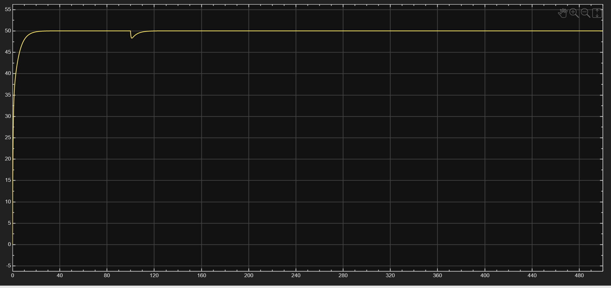
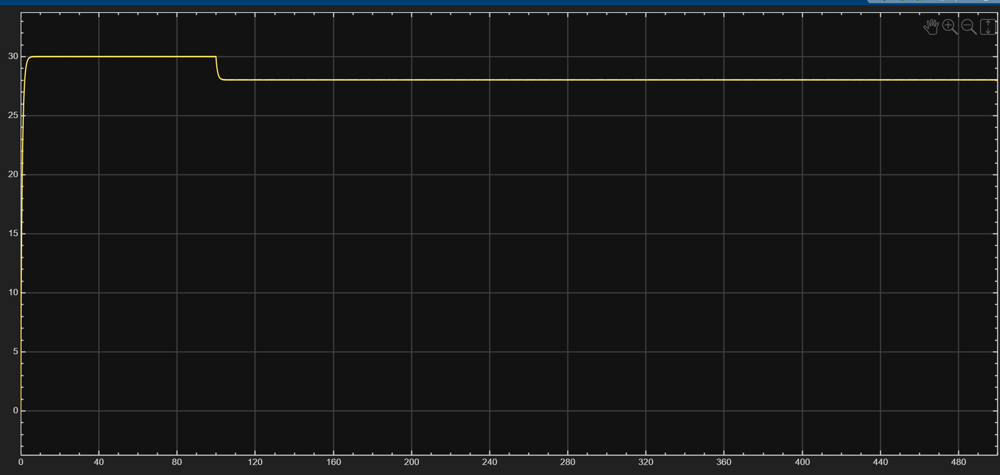
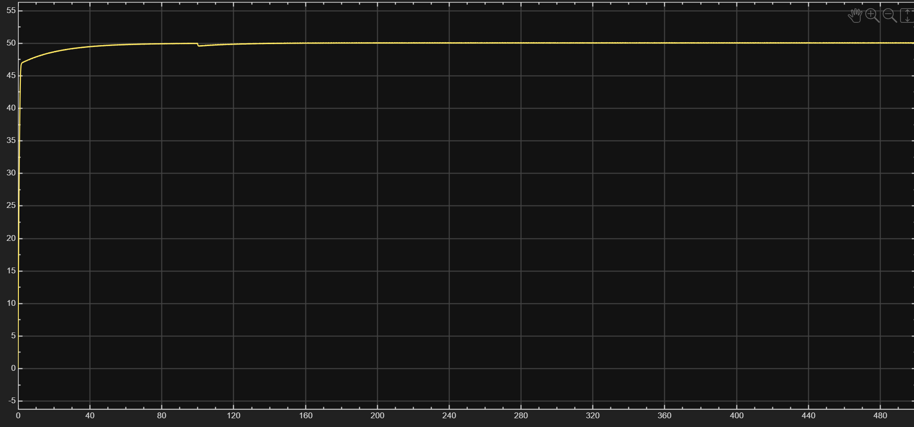
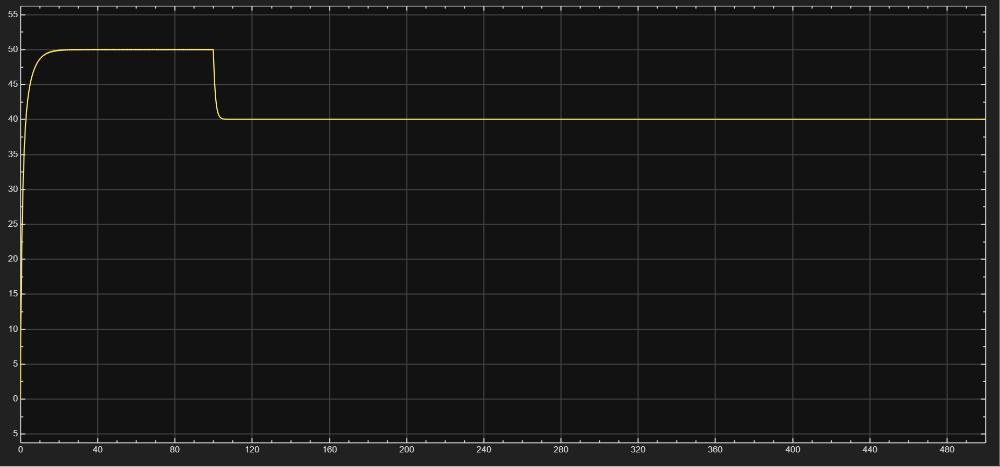
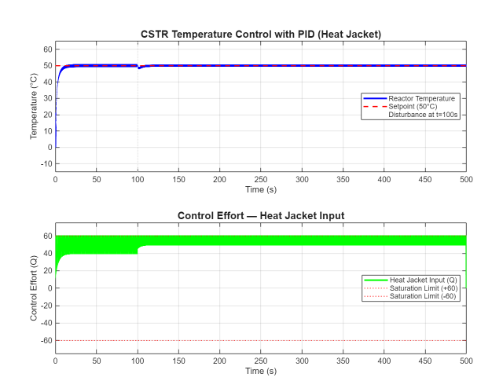

# CSTR Temperature Control Using PID — MATLAB & Simulink

---

## What Is This Project?

This project simulates automatic temperature control of a **Continuous Stirred Tank Reactor (CSTR)** using a **PID (Proportional-Integral-Derivative) controller**.

In simple terms: a chemical reactor needs to stay at exactly 50°C for the reaction to work correctly. If something disturbs the temperature — say, a cold feed stream enters suddenly — the controller has to detect that, react, and bring the temperature back to 50°C automatically.

This project builds that control system in two ways:
- **MATLAB script** — coded from scratch using the PID equations and Euler integration
- **Simulink model** — visual block diagram with the same logic, to validate consistency

Both produce the same result. That's the point.

---

## Why Did I Build This?

Most chemical engineering courses teach PID theory on paper. I wanted to see what it actually looks like when it runs — what happens when you remove a term, what happens when the disturbance is too large for the controller to handle, what happens when the actuator hits its physical limit.

The goal was not to just implement PID. The goal was to understand *why* each part of it exists.

---

## What I Built

### The System
The reactor is modelled as a **first-order process**:

```
dT/dt = (-T + Q + disturbance) / tau
```

- `T` = reactor temperature (°C)
- `Q` = heat jacket input (control effort, limited to ±60 units)
- `disturbance` = external cooling shock (applied at t = 100s)
- `tau` = time constant = 1s

### The Controller
```
Q(t) = Kp × e(t) + Ki × ∫e dt + Kd × de/dt
```

Where `e = T_setpoint - T_actual` (the error the controller is trying to eliminate)

### Final Tuned Parameters

| Parameter | Value | Role |
|-----------|-------|------|
| Setpoint | 50°C | Target reactor temperature |
| Kp | 1.5 | Drives temperature toward setpoint quickly |
| Ki | 0.5 | Eliminates steady-state error — locks temperature exactly at 50°C |
| Kd | 1.0 | Dampens overshoot — prevents temperature from shooting past 50°C |
| Saturation | ±60 | Physical limit of the heat jacket — can heat or cool |
| Disturbance | −5 at t=100s | Simulates a sudden cooling event |

---

## What Actually Happened — The Results

### Phase 1: Startup (0 to ~10 seconds)
Temperature rises from 0°C to 50°C rapidly. There is a very small overshoot — temperature touches ~51°C briefly before settling. The **Kd term** is responsible for catching this and pulling it back. The **Ki term** locks it precisely at 50°C and eliminates the residual error.

### Phase 2: Disturbance (t = 100s)
A cooling shock of −5 units hits the reactor. Temperature dips to ~49°C. The controller immediately detects the drop, increases heat jacket output, and recovers back to 50°C within approximately 20 seconds.

### Phase 3: Steady State (100s to 500s)
Temperature holds at exactly 50°C for the remaining 400 seconds. Control effort stabilises at ~50 units — well within the ±60 saturation limit, meaning the actuator still has headroom to handle larger disturbances.

---

## What I Learned By Experimenting

I didn't just run the final model. I ran four deliberate experiments by removing or changing one thing at a time:

### Experiment 1 — Remove Derivative (Kd = 0)
Temperature still reached 50°C but with a slightly larger overshoot. For a simple first-order system, this is manageable. In a real reactor with heat transfer lags or exothermic reactions, this overshoot could be dangerous.


**Lesson:** Kd is your damper. It becomes critical in faster or more complex systems.

### Experiment 2 — Remove Integral (Ki = 0)
Temperature settled at ~29°C and stayed there permanently. Never reached 50°C. After the disturbance, it dropped further and never came back.


**Lesson:** Without Ki, there is permanent steady-state error. Kp and Kd can react to errors but they cannot eliminate them. Ki is non-negotiable for precision temperature control.

### Experiment 3 — High Proportional Gain (Kp = 10)
Temperature reached setpoint faster. For this simple model, it still worked. But in a real plant with measurement noise, actuator lag, or a more complex process, Kp = 10 would cause violent oscillations or instability.
.

**Lesson:** High Kp improves speed but reduces stability margin. Tuning is always a tradeoff.

### Experiment 4 — Large Disturbance (−20 instead of −5)
Temperature settled at 50°C initially. After the disturbance, it dropped to ~40°C and never recovered — even after 400 seconds.
.

**Why:** To maintain 50°C with a −20 continuous disturbance, the controller needs 50 + 20 = 70 units of control effort. But the saturation limit is 60. The controller was asking for more than the hardware could deliver. It got stuck at ~40°C permanently.

**Lesson:** A well-tuned controller on an undersized actuator still fails. Equipment capacity matters as much as control logic.

---

## Real Industry Relevance

This project directly reflects problems that process engineers deal with in industrial plants.

**1. Reactor temperature control is everywhere.**
Refineries, pharmaceutical plants, polymer production, food processing — all of them run reactions that require precise temperature. A few degrees off means wrong product, reduced yield, or safety risk.

**2. PID is the most widely used controller in industry.**
Over 90% of industrial control loops use PID. Understanding it deeply — not just tuning it blindly — is what separates a process engineer from someone just clicking buttons on a DCS screen.

**3. Disturbance rejection is the real test.**
Any controller can hold a setpoint in a perfectly calm system. The real question is: what happens when a cold feed stream enters? When a pump trips? When ambient temperature drops? This simulation tests exactly that.

**4. Actuator saturation causes real plant shutdowns.**
Experiment 4 demonstrated a classic industrial failure — the controller was working correctly but the heat jacket was too small. This is why equipment sizing and control system design are done together, not separately.

**5. Digital twins save money.**
Building this simulation costs nothing. Running the wrong experiment on a real reactor costs time, product, energy, and sometimes safety. This is the exact idea behind digital twin technology — test in simulation before touching the real plant.

---

## Graph Explanations

### Graph 1 — Temperature vs Time


- **Blue line** = actual reactor temperature
- **Red dashed line** = target setpoint (50°C)
- The blue line rises, slightly overshoots, settles at exactly 50°C
- At t = 100s: visible dip from the cooling disturbance
- Full recovery within ~20 seconds, then stable for the remaining 400 seconds

### Graph 2 — Control Effort (Heat Jacket Input) vs Time
- **Green line** = Q, the signal the PID sends to the heat jacket
- **Red dotted lines** = saturation limits (±60)
- Q starts high (~60) to rapidly heat the reactor from 0°C
- Settles at ~50 units at steady state — this is the effort needed to maintain 50°C against the process losses
- Spikes briefly at t = 100s to fight the disturbance, then returns to ~50
- Never breaches the ±60 saturation limits in normal operation — the system has design headroom

---

## Project Files

| File | Description |
|------|-------------|
| `CSTR_PID_Temperature_Control.m` | MATLAB script — full PID simulation from scratch |
| `cstr_pid_temp.slx` | Simulink block diagram — visual implementation of same system |
| `cstr_pid_plots.png` | Output plot — temperature and control effort |

---

## How To Run

**MATLAB Script:**
1. Open MATLAB
2. Run `CSTR_PID_Temperature_Control.m`
3. Plot saves automatically as `cstr_pid_plots.png`

**Simulink:**
1. Open `cstr_pid_temp.slx`
2. Click Run (green play button)
3. Double-click the Scope block to view live response

---

## Contact

**Baljit Kaur**
B.Tech Chemical Engineering — NIT Jalandhar (2024–2028)
[LinkedIn](https://www.linkedin.com/in/baljit-kaur-b1ba15324/) | bk5721333@gmail.com
